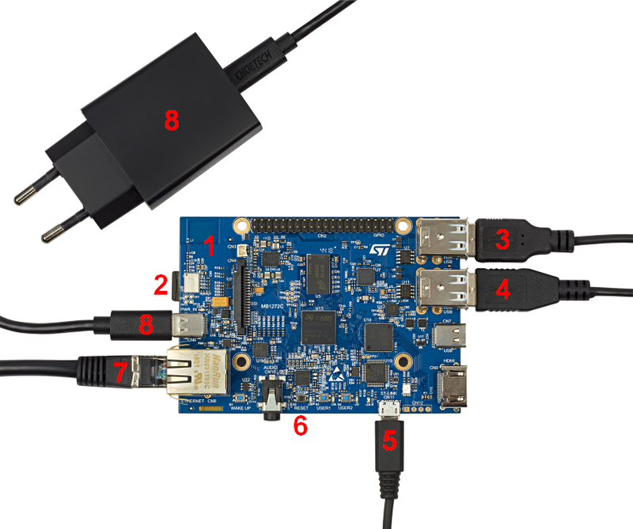
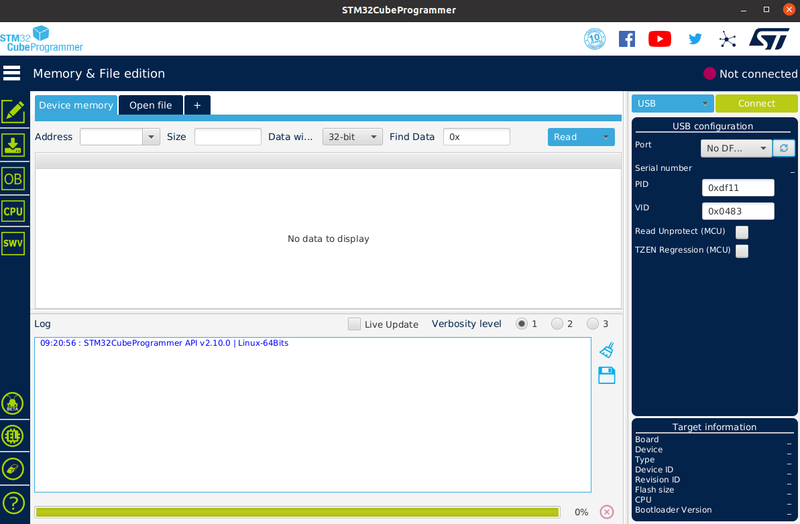
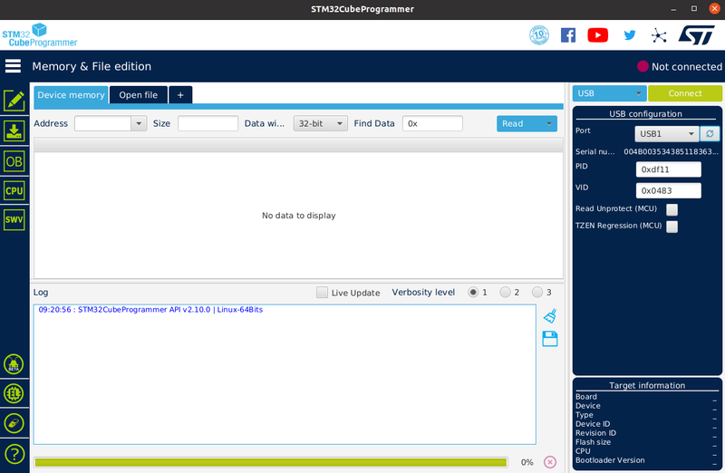

# X-LINUX_OTBR_POSIX Linux Package


The X-LINUX_OTBR_POSIX is a linux Package running on STM32MPU and tested on STM32MP157F-DK2. Openthread Border Router(OTBR) work with Radio Co Processor(RCP) STM32WB55 through a serial connection (FTDI) between STM32MPU and STM32WB. This meta-layer provide all recipes needed to compile ot-br-posix "https://github.com/openthread/ot-br-posix" on stm32mpu. 

Two cases for RCP  are available  :

  Matter/Openthread : Follow this github       [RCP-MATTER](https://github.com/stm32-hotspot/stm32wb-matter-device-over-thread/tree/main/Projects/P-NUCLEO-WB55.Nucleo/Binary_Thread_RCP)

  Openthread standalone : Follow this github   [RCP-OPENTHREAD](https://github.com/STMicroelectronics/STM32CubeWB/tree/v1.16.0/Projects/P-NUCLEO-WB55.Nucleo/Applications/Thread/Thread_RCP)


## Keywords 
OpenThread, OTBR, WI-FI, Internet of Things, Network, Connectivity, commissioning, CSA, Connectivity Standard Alliance, STM32MP1, P-NUCLEO-WB55 ,MATTER, CHIP, IoT.


## Release note
Details about the content of this release are available in the release note [here](https://htmlpreview.github.io/?https://github.com/stm32-hotspot/stm32mp1-otbr-posix/blob/main/Release_Notes.html).

## Boards Needed
 * Openthread Boarder Router 
    * [STM32MP157F-DK2](https://www.st.com/en/evaluation-tools/stm32mp157f-dk2.html)

  * as Thread RCP firmware P-NUCLEO-WB55  ST Radio Co-Processor (RCP) if used
    * [NUCLEO-WB55RG](https://www.st.com/en/evaluation-tools/nucleo-wb55rg.html) 
	
## System Requirements 
A Linux® PC running under Ubuntu® 18.04 or 20.04 is to be used. The developer can follow the below link. https://wiki.st.com/stm32mpu/wiki/PC_prerequisites

## BUILD: 

This is required to build the recipes and create STM32MP1 images (see https://wiki.st.com/stm32mpu/wiki/STM32MP1_Distribution_Package). 

Create source folder

```
PC $> mkdir ~/stm32mp1_openthread 
```
```
PC $> cd stm32mp1_openthread
``` 

Initialize repo in the current directory

```
PC $> repo init -u https://github.com/STMicroelectronics/oe-manifest.git -b refs/tags/openstlinux-5.15-yocto-kirkstone-mp1-v22.11.23
```

Synchronize the local project directories with the remote repositories specified in the manifest (more details on 'repo sync' here)

```
PC $> repo sync
```

Get the STM32MP1 OTBR repository

```
PC$> git clone "https://github.com/stm32-hotspot/stm32mp1-otbr-posix.git"
```

Initializing the OpenEmbedded build environment
- For MP15
```
PC $> DISTRO=openstlinux-weston MACHINE=stm32mp1 source layers/meta-st/scripts/envsetup.sh
```

- For MP13

```
PC $> DISTRO=openstlinux-weston MACHINE=stm32mp13-disco source layers/meta-st/scripts/envsetup.sh
```

Prepare the Yocto layer related to OBTR

```
PC$> cp -R ../stm32mp1-otbr-posix/meta-otbr ../layers/meta-st/
```

```
PC$> bitbake-layers add-layer ../layers/meta-st/meta-otbr
```

Build the ST32MP1 image (this might take several hours to complete depending on your network connection and your PC performance)

```
PC$> bitbake st-image-otbr
```


## Flashing the built image

The *build-<distro>-<machine>/tmp-glibc/deploy/images/stm32mp1* directory receives complete file system images.

Note that the build of the Distribution Package generates the images and the Flash layout files 


https://wiki.stmicroelectronics.cn/stm32mpu/wiki/STM32MP157x-DKx_-_hardware_description#Boot_related_switches


1. MB1272 motherboard: STM32MP157x 12x12, PMIC, DDR3
2. MicroSD card slot
3. 2 x USB Type-A (host) → mouse, keyboard or USB driver
4. 2 x USB Type-A (host) → mouse, Keyboard or USB driverUSB
5. micro-B (ST-LINK/V2-1) → PC virtual COM port and debug
6. Reset button
7. Ethernet → Network
8. USB Type-C (power 5V-3A)

 


Let's flash the downloaded image on the microSD card:
* Set the boot switches (1) to the off position
* Connect the USB Type-C™ (OTG) port (2) to the host PC that contains the downloaded image
* Insert the delivered microSD card into the dedicated slot (3)
* Connect the delivered power supply to the USB Type-C™ port (4)
* Press the reset button (5) to reset the board


 


1. Launch STM32CubeProgrammer to get the GUI
2. On the top right of the window, select USB (instead of STLINK, set by default) in the connection picklist and click the "Refresh" button. The serial number is displayed if the USB is detected. Then click "Connect".



3. Refresh and press to Connect 



4. Select the "Open File" tab and choose the "FlashLayout_sdcard_stm32mp157f-dk2-optee.tsv"  through this path  *build-<distro>-<machine>/tmp-glibc/deploy/images/stm32mp1/flashlayout_st-image-otbr/extensible*

5. Fill the *Binaries Path" by browsing to the "build-<distro>-<machine>tmp-glibc/deploy/images/stm32mp1/*


command lines can be run from Terminal through USB with st-link 

Note: in this article, any command executed on the board (through the remote Terminal or the Wayland Terminal) starts with BOARD$> , while any command executed on the host PC starts with PC$> 


## Getting board IP address with Ethernet 

 plug in ethernet cable (7)

```
 BOARD$> ip addr show eth0
 eth0: <BROADCAST,MULTICAST,UP,LOWER_UP> mtu 1500 qdisc mq state UP group default qlen 1000
    link/ether xx:xx:xx:xx:xx:xx brd ff:ff:ff:ff:ff:ff
    inet xx.xx.xx.xx/xx brd xx.xx.xx.xx scope global dynamic eth0
       valid_lft 159045sec preferred_lft 159045sec
    inet6 xxxx::xx:xx:xx:xx/xx scope link 
       valid_lft forever preferred_lft forever
```

## Wlan Network attachment

```
BOARD$>  ifconfig wlan0 up
```

```
BOARD$>  ifconfig wlan0 
         wlan0     Link encap:Ethernet  HWaddr 60:F1:89:3F:F6:0E  
            inet addr:192.168.43.135  Bcast:192.168.43.255  Mask:255.255.255.0
            UP BROADCAST RUNNING MULTICAST  MTU:1500  Metric:1                   /* UP indicate that your interface is UP */
            RX packets:19 errors:0 dropped:0 overruns:0 frame:0
            TX packets:19 errors:0 dropped:0 overruns:0 carrier:0
            collisions:0 txqueuelen:1000 
            RX bytes:1774 (1.7 KiB)  TX bytes:2326 (2.2 KiB)
```

Scan available SSID (Access Point):

```
BOARD$> iw dev wlan0 scan | grep SSID
        SSID: NETWORK1
        SSID: NETWORK2
```


Set the Wi-Fi network name and password:

```
BOARD$> wpa_passphrase <your_ssid_name> <your_ssid_key> >> /etc/wpa_supplicant.conf
```

Check new configuration:

```
BOARD$> cat /etc/wpa_supplicant.conf
        ctrl_interface=/var/run/wpa_supplicant
        ctrl_interface_group=0
        update_config=1
        network={
         ssid="your_ssid_name"
         psk="your_ssid_key"
      }
```

Connect to SSID:

```
BOARD$> wpa_supplicant -B -iwlan0 -c /etc/wpa_supplicant.conf
```

link to SSID:

```
BOARD$> iw wlan0 link
        SSID: NETWORK1
        freq: 2462
        RX: 501 bytes (3 packets)
        TX: 4056 bytes (22 packets)
        signal: -75 dBm
        tx bitrate: 12.0 MBit/s
        bss flags:      short-preamble short-slot-time
        dtim period:    1
        beacon int:     100
```

For more information : https://wiki.st.com/stm32mpu/wiki/How_to_setup_a_WLAN_connection

## Configuration otbr-posix on STM32MP1
For first boot you must config otbr-agent  with this command 

```
BOARD$>  bash /usr/bin/otbr_setup.sh 
```
```
BOARD$>  reboot
```
## Example to setup Border Router 


```
BOARD$>  ot-ctl thread stop 
```

```
BOARD$>  ot-ctl ifconfig down 
```

```
BOARD$>  ot-ctl networkkey 00112233445566778899aabbccddeeff
```

```
BOARD$>  ot-ctl extpanid 1111111122222222
```

```
BOARD$>  ot-ctl panid 1234
```

```
BOARD$>  ot-ctl channel 15 
```

```
BOARD$>  ot-ctl ifconfig up 
```

```
BOARD$>  ot-ctl thread start 
```


Following this link for more information https://openthread.io/guides/